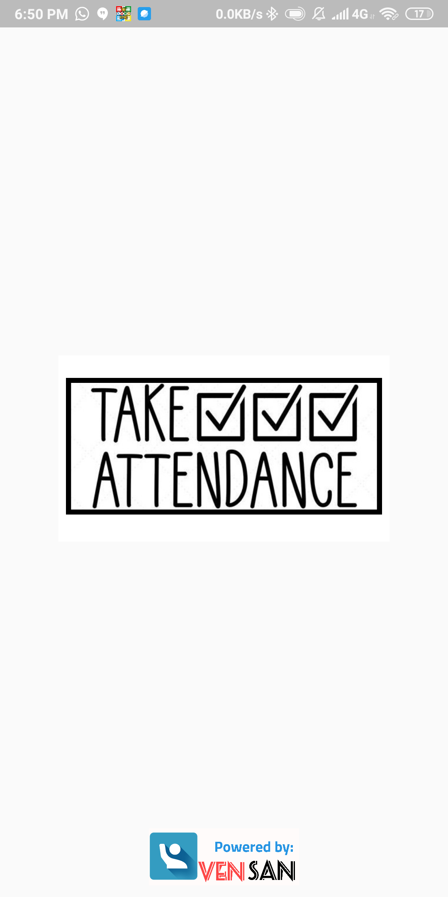
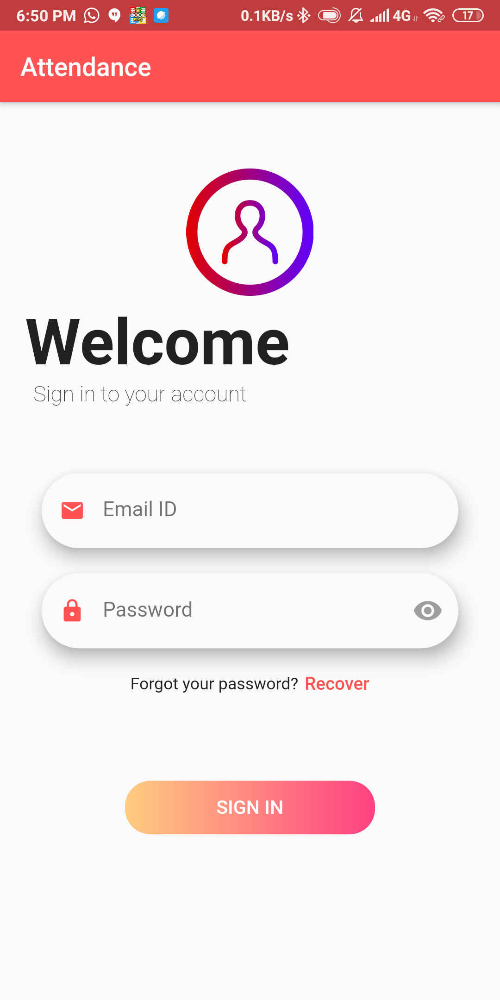
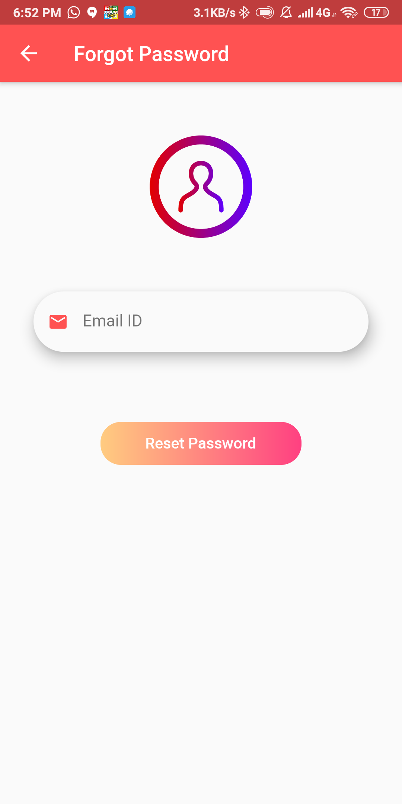
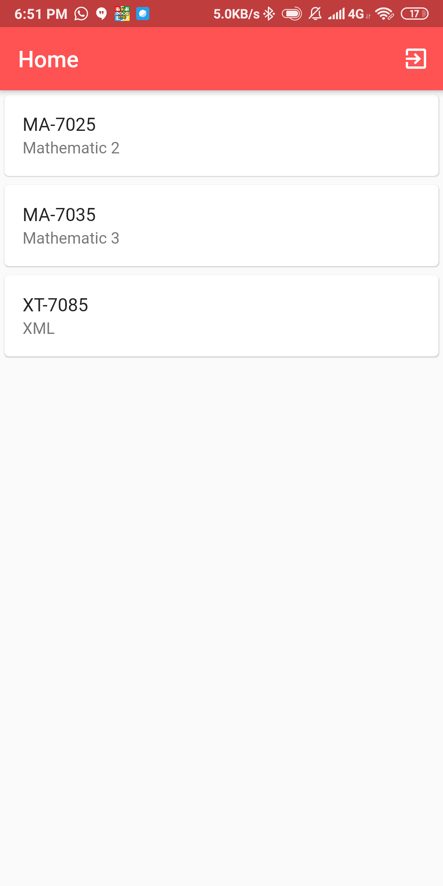
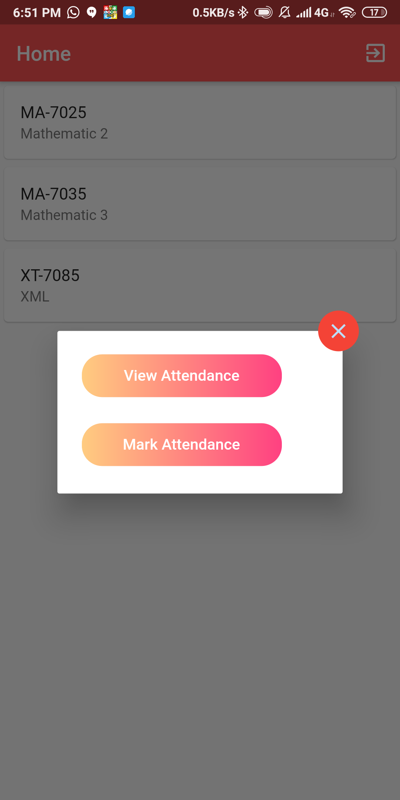
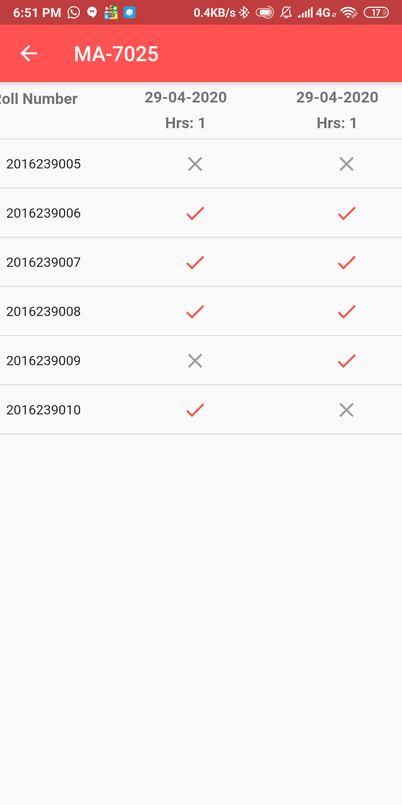
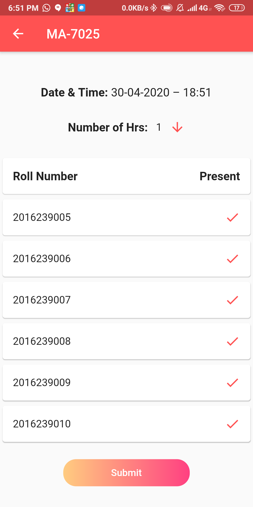

# Attendance
 This is an Attendance app for marking and viewing attendance developed with flutter and firebase. The Product has two parts 1) A [NodeJS script](script/app.js) which act as a dummy enrollment server, 2) A Flutter app for both Android and IOS. Implemented RBAC for the app with three roles such as student, staff and admin each having their own access permissions.

# Screenshots

# Contributions
Contributions are welcome. Please read the [contributions guide](CONTRIBUTING.md) for more information.

## Getting Started

A few resources to get you started if this is your first Flutter project:

- [Lab: Write your first Flutter app](https://flutter.dev/docs/get-started/codelab)
- [Cookbook: Useful Flutter samples](https://flutter.dev/docs/cookbook)

For help getting started with Flutter, view our
[online documentation](https://flutter.dev/docs), which offers tutorials,
samples, guidance on mobile development, and a full API reference.
